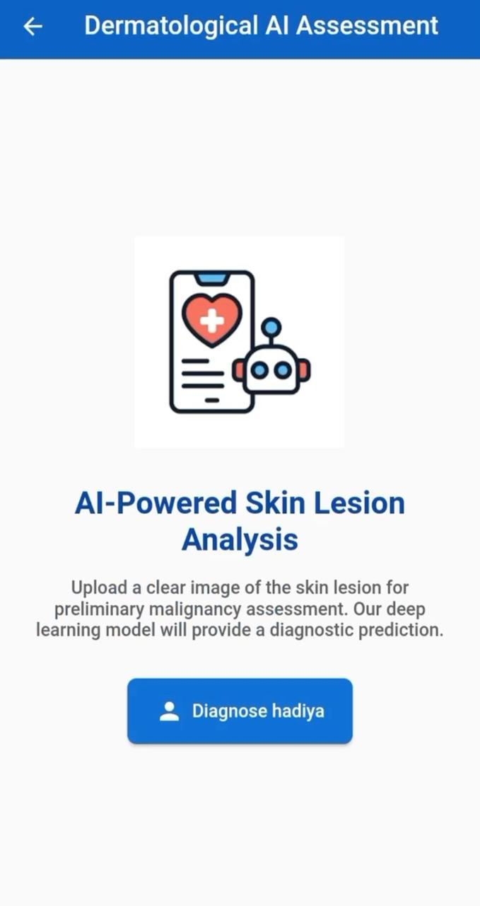
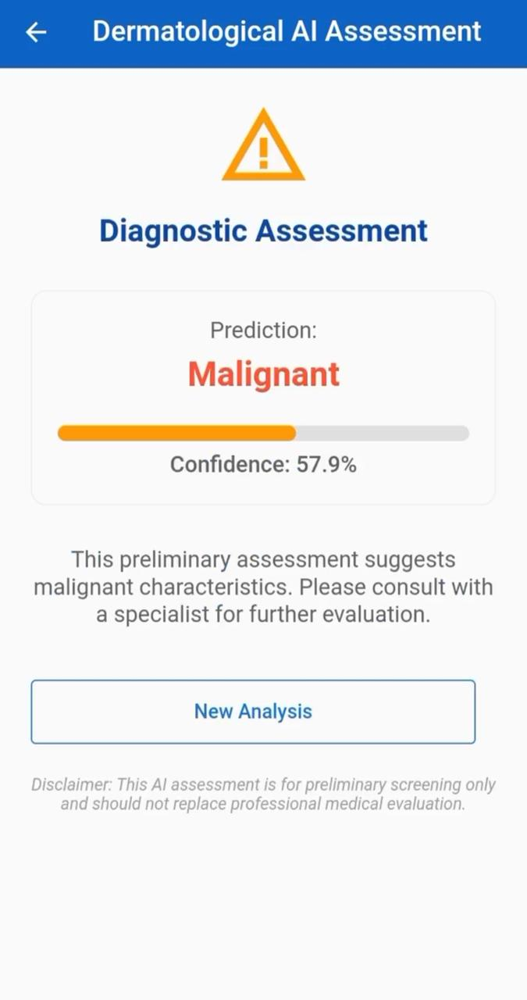
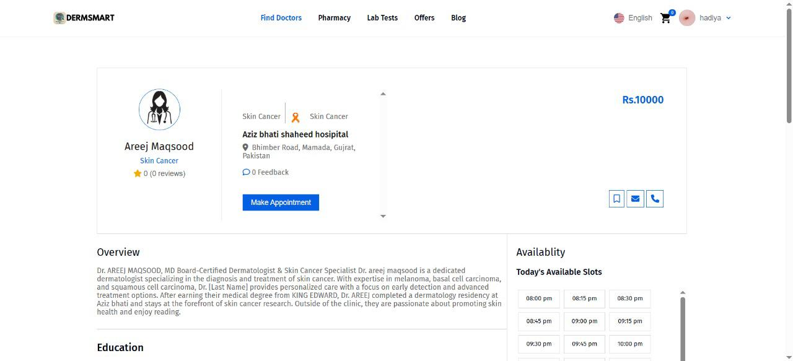
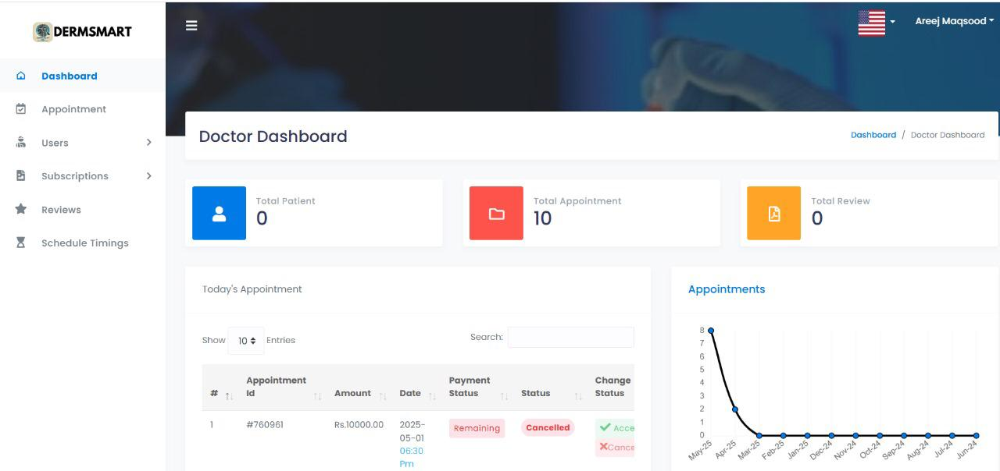

# DermSmartAI 🩺🤖

**DermSmartAI** is an AI-powered healthcare platform designed to assist in **skin cancer detection** and enhance **patient–doctor interactions**.  
It provides two dedicated apps — one for **Doctors** and one for **Patients** — enabling early detection, online consultations, appointment management, community support, and more.  
## 📱 Apps Overview

### 👨‍⚕️ Doctor App
- AI-powered skin cancer detection using CNN + TensorFlow Lite.  
- Manage online & physical appointments.  
- Conduct secure online consultations (chat/video).  
- Write and share prescriptions digitally.  
- Track payments and earnings.  
- Edit and manage doctor profiles.  

### 🧑‍⚕️ Patient App
- Search doctors by name, area, language, or gender.  
- Book appointments (online & physical).  
- Pay online before online consultations or at the hospital for physical visits.  
- Request AI-supported online consultations.  
- Share blogs/articles about skin cancer experiences.  
- Join community forums for awareness & support.  
- Set health reminders for medication, skin checks, and follow-ups.  
- Rate and give feedback to doctors.  

## 🚀 Key Features
✔️ AI-based Skin Cancer Detection  
✔️ Doctor–Patient Communication (chat/video)  
✔️ Appointment Management with reminders  
✔️ Blogs & Patient Community Forum  
✔️ Hospital Listings for skin cancer treatment centers  
✔️ Digital Prescriptions & Payment Tracking  
✔️ Feedback and Ratings System  

## 🛠️ Tech Stack
- **Frontend:** Flutter  
- **Backend:** Flutter/Dart APIs  
- **AI Module:** CNN, TensorFlow Lite  
- **Database:** Firebase / SQLite  
- **Admin Panel:** Web-based (for authentication & management)  

## 📂 Project Structure
- `doctro_doctor_app-v7.3.0/` → Doctor app  
- `patient_app/` → Patient app  

## ⚡ Getting Started

### 1. Clone the repository
```bash
git clone https://github.com/areejmaq/AI-mobile-application.git


⚠️THIS APPLICATION IS JUST FOR EDUCATIONAL PURPOSE , ALWAYS CONSULT THE DOCTOR FOR HEALTH ISSUES.
💡USE YOUR OWN API KEPS, FIREBASE,SERVER KEYS ETC.

## 📸 Screenshots

### Doctor App




### Patient App


### Web Panel

